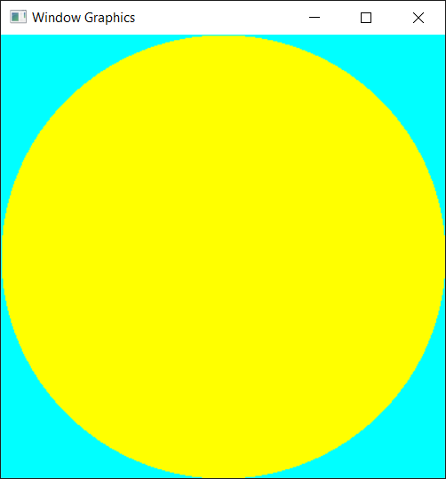
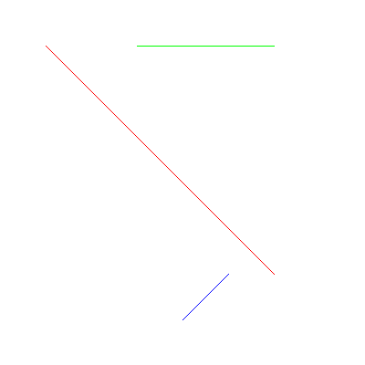
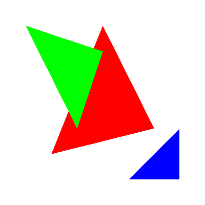

# Window Graphics
```CPP
/** FRAME DRAW **/
FRAME frame(windowWidth, windowHeight, hwnd);
frame.clear({ 0,255,255 });

frame.pen_color = { 255,255,0 };
frame.set_circle(200, 200, 200);

frame.print();
```

## Result ##


The basic library of window graphics in clear C++ and WinAPI. Using drawing methods, you can create typical geometric elements.

## Dots ##


## Lines ##


## Triangles ##
